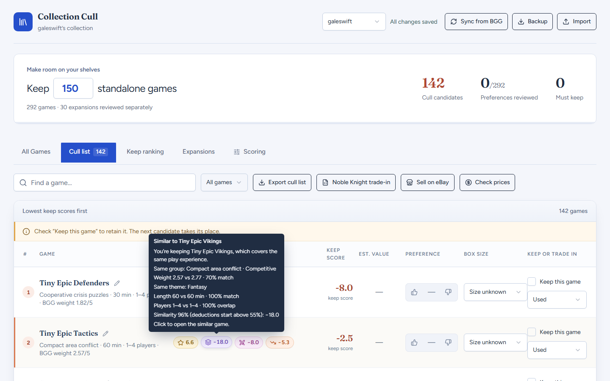
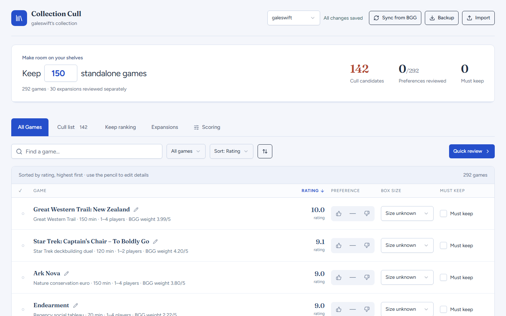
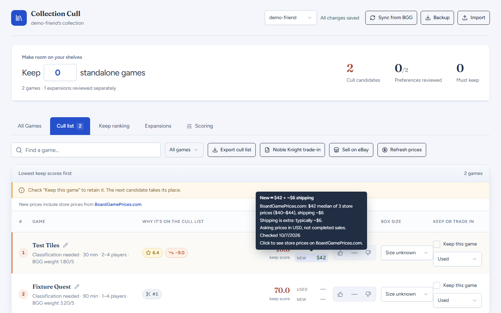
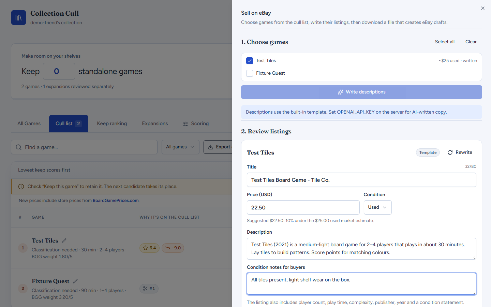

# Collection Cull

A web app for trimming a board game collection. It scores every game you own, spots the ones that fill the same slot on your shelf, and helps you trade in or sell the ones you let go.

**Live site:** https://boardgameculler-production.up.railway.app/ — my collection is behind a password, but **Try the demo** on the front page opens a sample collection of about 300 games to explore. Nothing you change in the demo is saved, and it doesn't check live prices or use AI (eBay descriptions come from the built-in template).

(Description by me, not Claude):
I (read:Claude) built it to cull my(Not Claude's) own collection of around 300 games.  I just wanted to see what the overlap was between games in my library, so I could feel ok about getting rid of games and not introducing a hole in the experiences I had.  In addition, I wanted to show relative values of the items I'm getting rid of, and added the ability to keep or influence the scoring.  I(read:Claude) added the ability to export the results into the noble knight trade-in template, or generate a spreadsheet that ebay can use (which includes some descriptions based on user comments).



## What it does

- **Imports your collection from BoardGameGeek.** Enter a BGG username and it pulls in the games you own, with ratings, weight, play time and player counts. Each username gets its own collection, so friends can try theirs too.
- **Scores every game** using your ratings (or BGG's), your thumbs up or down, how mean the interaction is, and box size.
- **Finds overlap.** Games are sorted into play groups, like "Cooperative crisis puzzles" or "Tile drafting landscapes". Within a group, games of similar weight, length, theme and player count count as substitutes, and the weaker one loses points. Play groups are assigned automatically with OpenAI for imported collections, and you can edit any of them.
- **Builds a cull list** to hit a target number of games, with a chip for each reason a game is on it. Hover a chip to see the details, like which game it overlaps with and why.
- **Estimates what each game is worth,** used and new. It combines BGG GeekMarket listings with in-stock US store prices from [BoardGamePrices.com](https://boardgameprices.com), filters out accessory listings and obvious outliers, and keeps shipping separate.
- **Exports a Noble Knight Games trade-in sheet,** filled into their own template, with a condition picked for each game.
- **Writes eBay listings.** Pick games from the cull list, and it writes a description from BGG data, the publisher's blurb and what players say in reviews and comments, in a casual voice. It suggests a price 10% under the market estimate, then downloads a file that creates eBay draft listings in bulk.

<table>
  <tr>
    <td></td>
    <td></td>
  </tr>
  <tr>
    <td align="center">Every game, sortable by any column</td>
    <td align="center">Price estimates, with sources and shipping</td>
  </tr>
  <tr>
    <td colspan="2"></td>
  </tr>
  <tr>
    <td colspan="2" align="center">Writing eBay draft listings</td>
  </tr>
</table>

## How it's built

- **Next.js** (React) for the app and its API routes, running as a Docker container on **Railway** with **Postgres**.
- **BoardGameGeek XML API** for collections, game details, GeekMarket listings, comments and review forums.
- **BoardGamePrices.com API** for store prices (cached and credited, as their terms ask).
- **OpenAI** (optional) for play groups and listing descriptions. Without a key, descriptions fall back to a template.
- **Vitest** for unit and API tests, and **Playwright** for browser tests against a fake BGG, a fake store-price service and an in-memory Postgres (PGlite).

## Running it locally

You'll need Node 22.13 or later and pnpm.

```sh
pnpm install
cp .env.example .env.local   # then fill in the values
pnpm dev                     # http://localhost:3000
```

| Variable | Needed for |
|---|---|
| `DATABASE_URL` | Postgres connection string (required) |
| `APP_PASSWORD` | The sign-in password (required) |
| `BGG_API_TOKEN` | Importing from BGG and GeekMarket prices. Register an app at [boardgamegeek.com/applications](https://boardgamegeek.com/applications). |
| `OPENAI_API_KEY` | Play groups and AI-written descriptions (optional) |
| `OPENAI_MODEL` | Model for those (optional, default `gpt-5-mini`) |
| `DEFAULT_PROFILE` | The collection opened by default (optional) |
| `SITE_URL` | Public URL sent to BoardGamePrices.com (optional) |

Tables are created automatically on first use.

## Tests and formatting

```sh
pnpm test        # unit and API tests
pnpm test:e2e    # browser tests (first run: npx playwright install chromium)
pnpm format      # Prettier plus the house brace style
```

## Deploying

The repo deploys to Railway as is: it builds from the `Dockerfile`, and `railway.json` sets the health check. Add a Postgres database to the project, set `DATABASE_URL` to `${{Postgres.DATABASE_URL}}` on the app service along with the variables above, and generate a domain.
